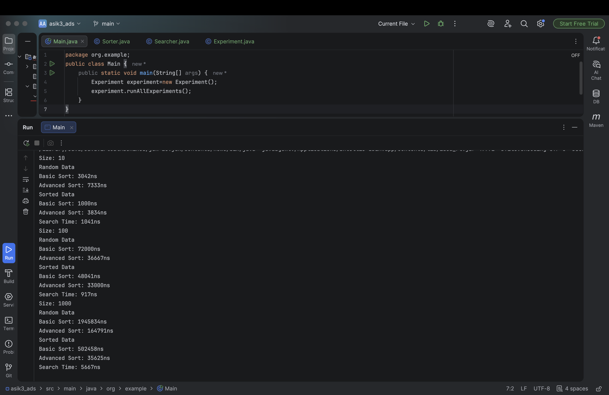

# Assignment3
**Name:** Yerkenaz Azat
**Group** SE-2514

For this experiment, I implemented this algorithms:

1. **Bubble Sort(Basic):** It compares neighbor elements and swaps them if they are in the wrong order.
2. **Merge Sort(Advanced):** It divides the array into two halves, sorts them recursively, and then merges them back together.
3. **Linear Search:** It checks every element in the array one by one until the target id found.

## Experimental results
| Size | Input Type | Basic Sort | Advanced Sort | Search Time |
| :--- | :--- | :--- | :--- | :--- |
| **10** | Random | 3042ns | 7333ns | 1041ns |
| **10** | Sorted | 1000ns | 3834ns | - |
| **100** | Random | 72000ns | 36667ns | 917ns |
| **100** | Sorted | 48041ns | 33000ns | - |
| **1000** | Random | 1945834ns | 1644791ns | 5667ns |
| **1000** | Sorted | 502458ns | 35625ns | -|

## Analysis Questions
1. **Which sorting algorithm performed faster? Why?** Merge Sort was much faster for the 1000 size array. This is because O(n\logn) is more efficient than O(n^2) when the data is large.
2. **How does performance change with input size?** When the size grows, Bubble Sort's time increases very fast, but Merge Sort's time increases more slowly.
3. **How does sorted vs unsorted data affect performance?** Sorted data makes Bubble Sort faster because it does fewer swaps. Merge Sort is stable and stays fast in both cases.
4. **Do the results match the expected Big-O complexity?** Yes, the results match. At size 1000, the gap between the two algorithms is very big, just like the theory says.
5. **Which searching algorithm is more efficient? Why?** I used Linear Search, which is O(n). It is fine for small arrays, but Binary Search would be better for very large sorted arrays.
6. **Why does Binary Search require a sorted array?** Because it needs to know which half of the data to skip. If it's not sorted, we can't be sure where the target is.

### Screenshot of my output:
